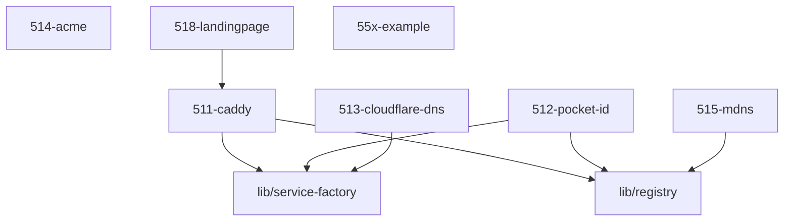

# LLM Wiki: `51-ingress`

Agentenorientierte Arbeitskarte. Menschliche Architektur-/Betriebsdoku: [`README.md`](README.md).

**Rolle:** Edge-/Ingress-Domäne — die Zugangsschicht in die Dienste.

**Verantwortung:**
- HTTP(S)-Ingress und Caddy (511)
- Auth-/OIDC-Integration (512)
- DNS/DDNS (513)
- ACME/TLS (514)
- mDNS (515)
- Landingpage (518)
- Ingress-Guardrails und Ownership-Konflikte (519)

**Nicht verantwortlich für:**
- Host-Firewall und Host-Security → `52-security`
- Service-Definitionen → jeweiliges Service-Modul
- Media-Daten/Storage → entsprechende Domäne

**Source of truth:**
- Service-/Vhost-Intent → `ingress.vhosts`
- Runtime-Identitäten → `lib/registry.nix`
- Modulbeziehungen → NIXMETA-Header
- Caddy-Implementierung → `511-caddy.nix`

**Arbeitsregel:**
- Änderungen an Ingress zuerst gegen den bestehenden Contract prüfen.
- Keine zweite Service-/Route-Inventarliste erzeugen.
- Keine Ownership implizit übernehmen.

<!-- AUTO-GENERATED, DO NOT EDIT BELOW -->

## Module Map

| ID | Modul-Datei | Status | Komplexitaet | Ports |
|---|---|---|---|---|
| `511-caddy` | `511-caddy.nix` | active | 4/5 | - |
| `512-pocket-id` | `512-pocket-id.nix` | active | 4/5 |  |
| `513-cloudflare-dns` | `513-cloudflare-dns.nix` | active | 4/5 | - |
| `514-acme` | `514-acme.nix` | active | 3/5 | - |
| `515-mdns` | `515-mdns.nix` | active | 3/5 | - |
| `518-landingpage` | `518-landingpage.nix` | active | 2/5 | - |
| `55x-example` | `55x-service.example.nix` | template | -/5 | - |

## Interne Abhaengigkeiten (Requires)

Die Module in diesem Ordner benoetigen folgende Bibliotheken/Dateien:

- `511-caddy`
- `lib/registry`
- `lib/service-factory`

## Dependency Graph

---
*Generiert durch `medinix-meta.py generate-docs`*
