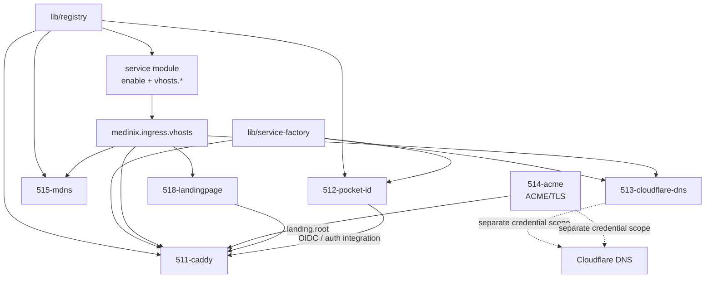

# 51-ingress: Ingress & Edge Domain

The **Ingress Domain** is the front door of mediNix-core.

It owns the **access path into services**:

* reverse-proxy routing
* TLS termination
* DNS anchors
* mDNS aliases
* authentication integration
* edge-level request filtering and protection

It does **not** own individual applications.

> **A service describes itself. Ingress organs consume that description.**

## Security boundary

The decimal domains have deliberately different responsibilities:

> **`51-ingress` = protect the door and control who gets through.**
> **`52-security` = protect the house itself.**

Therefore, edge-facing controls belong in `51-ingress`, including:

* access-group policy
* authentication boundaries
* Geo-IP policy where enabled
* CrowdSec integration where enabled
* request/rate limiting where implemented
* edge request filtering

Host-level protection belongs in `52-security`, including:

* host firewall ownership
* secrets and credentials
* VPN confinement
* system-level security policy

The separation is architectural, not merely organizational.

---

## Scope and ownership rules

Ingress is deliberately **service-agnostic**.

No application-specific knowledge belongs in the generic ingress organs.

In particular:

* `511-caddy.nix` must not contain application-specific route knowledge.
* `513-cloudflare-dns.nix` must not contain a second service inventory.
* `515-mdns.nix` must not contain application-specific policy.
* `518-landingpage.nix` must not maintain a preferred-service list or icon registry.
* application-specific knowledge remains in the corresponding service module.

For example, Seerr knowledge belongs in `555-seerr.nix`, not in 511 or 518.

A new service therefore follows this pattern:

```text
new service module
      │
      ├── service configuration
      └── ingress.vhosts.<name>
                │
                ├── 511 Caddy
                ├── 513 DNS
                ├── 515 mDNS
                └── 518 landing page
```

The ingress engine consumes the declaration; it does not become the owner of the service.

---

# How a service joins the edge

A service declares its own ingress metadata:

```nix
lib.mkIf cfg.enable {
  medinix.ingress.vhosts."seerr" = {
    accessGroup = reg.caddyClass;   # stream | internal | public | idp | none
    landing     = true;
    iconSvg     = ''<svg xmlns="http://www.w3.org/2000/svg" viewBox="0 0 96 96">…</svg>'';
  };
}
```

The important rule is:

> **The service declares what it is. Ingress decides how that declaration is materialized at the edge.**

## Contract fields

| Field                   | Declared by            | Consumed by                          |
| ----------------------- | ---------------------- | ------------------------------------ |
| `cfg.enable`            | service module         | that service's systemd configuration |
| `ingress.vhosts.<name>` | service module         | 511, 513, 515, 518                   |
| `accessGroup`           | service module         | 511                                  |
| `landing`               | service module         | 518                                  |
| `iconSvg`               | service module         | 518                                  |
| `dns.hostnames.<name>`  | host/DNS configuration | 511, 513, 518                        |

Application modules therefore do not edit Caddy configuration directly.

---

# Access groups

`accessGroup` is the service's ingress classification.

It is consumed by 511 to derive the appropriate access policy.

The value is **policy metadata**, not an application name.

Typical classes are:

```text
stream
internal
public
idp
none
```

The exact behavior is defined by the 511 ingress implementation and its assertions.

An empty or missing security boundary must not silently turn into an open route. Security-sensitive behavior is therefore driven by **explicit intent** and fail-closed assertions.

---

# Dependency model

There are two deliberately different graphs.

## 1. Compile-time module metadata

NIXMETA headers declare `requires` and `provides`.

```text
python3 50-core/medinix-meta.py generate-docs
        │
        ▼
     AGENTS.md
```

The generated graph describes declared module/library relationships.

It is **not** a complete runtime data-flow graph.

Current examples:

| Module             | `requires`                            | `provides`                |
| ------------------ | ------------------------------------- | ------------------------- |
| 511-caddy          | `lib/service-factory`, `lib/registry` | routing / Caddy engine    |
| 512-pocket-id      | `lib/service-factory`, `lib/registry` | Pocket-ID / OIDC          |
| 513-cloudflare-dns | `lib/service-factory`                 | DDNS / Cloudflare         |
| 514-acme           | —                                     | ACME / TLS / certificates |
| 515-mdns           | `lib/registry`                        | mDNS aliases              |
| 518-landingpage    | `511-caddy`                           | landing HTML              |

Do **not** add artificial `requires` edges merely because one module consumes data generated by another at evaluation or runtime.

For example, 511 does not import 514 as a Nix module simply because 514 provides certificate material consumed by the resulting Caddy configuration.

If the compile-time dependency graph is intentionally changed, update the module header and regenerate `AGENTS.md`.

Never hand-edit the generated section of `AGENTS.md`.

---

## 2. Runtime/data-flow contract

The runtime relationship is better represented as:



The important distinction is the credential boundary:

> **ACME and DDNS use separate Cloudflare credentials.**

There is no generic credential fallback between the two.

---

# Module boundaries

| Module  | Allowed to know                                            | Must not own                                           |
| ------- | ---------------------------------------------------------- | ------------------------------------------------------ |
| **511** | vhosts, access groups, domain, TLS material, auth contract | application knowledge, icons, DNS writes, Avahi policy |
| **512** | Pocket-ID process and its service configuration            | Caddyfile, ACME, DNS                                   |
| **513** | vhost names and DNS hostname values                        | application-specific inventories                       |
| **514** | `acmeHost`, ACME credential, certificate configuration     | Caddy ACME configuration, HTTP-01, DDNS token          |
| **515** | vhost names and LAN/landing context                        | Caddy, TLS, HTML                                       |
| **518** | `landing`, `iconSvg`, public host information              | preferred-service lists, icon maps, `/go/*`, JS, Caddy |

This separation is intentional.

If a module needs information outside its declared boundary, the preferred solution is to define an explicit contract rather than introduce an implicit cross-module dependency.

---

# 511 — Chameleon Caddy

`511-caddy.nix` is the edge engine.

It supports the three host-integration modes:

```text
auto
global
standalone
```

The mode determines how mediNix integrates with an existing Caddy installation.

The important ownership principle is:

> **`auto` detects; `global` integrates; `standalone` owns the Caddy service.**

The module generates Caddy configuration from one authoritative site/vhost representation rather than maintaining parallel hand-written route inventories.

The current security model is intentionally fail-closed:

* `trustedCidrs` defaults to an empty list.
* active ingress requires explicit trusted CIDRs.
* `localBypass` defaults to disabled.
* unauthenticated paths are explicitly named.
* public unauthenticated access requires explicit intent.
* forward-auth requires an explicit upstream.
* request-auth headers are stripped using request-header handling before authentication.
* authentication bypasses are not inferred from application defaults.

---

# Authentication contract

Ingress distinguishes the **identity provider** from the **forward-auth enforcement endpoint**.

Pocket-ID is an OIDC identity provider. It is therefore not silently treated as a generic `/oauth2/auth` forward-auth endpoint.

For:

```text
auth.mode = "forward-auth"
```

the configuration must provide an explicit `forwardAuthUpstream`.

Typical architecture:

```text
browser
   │
   ▼
 Caddy / 511
   │
   ├── public route
   │
   └── forward_auth
          │
          ▼
   explicit auth gateway
          │
          ▼
      identity / OIDC
          │
          ▼
       Pocket-ID
```

The important contract is:

> **OIDC provider ≠ forward-auth endpoint.**

An invalid or missing forward-auth upstream is an assertion failure, not a silent fallback.

---

# Addresses

The conceptual address model is:

```text
https://{name}.{domain}
    └── HTTPS ingress; policy derived from accessGroup


http://{name}.{domain}
    └── redirects to HTTPS when TLS is enabled


http://{name}.local
    └── LAN-only mDNS naming path
```

`.local` is a **naming mechanism**, not a security boundary.

Authentication and network access controls must therefore not rely on the `.local` suffix itself.

The landing page is exposed through the configured root hostname and `home.local` when enabled.

---

# TLS and DNS

## 513 — Cloudflare DNS

513 owns the DNS anchor mechanism.

Its job is deliberately simple:

```text
vhost declarations
       │
       ▼
DNS hostname set
       │
       ▼
Cloudflare DNS anchor/prune
```

It must not maintain a second list of applications.

The DNS credential is explicitly scoped to the DDNS operation.

## 514 — ACME

514 owns wildcard certificate issuance through DNS-01.

The ACME credential is separate from the DDNS credential.

The implementation uses systemd credentials and does not rely on the DDNS token as a fallback.

The `domain`/`acmeHost` relationship is validated so that a requested hostname cannot silently escape the intended certificate domain.

---

# 515 — mDNS

515 is the sole Avahi owner for the ingress aliases.

Its purpose is convenience:

```text
service.local
```

maps to the LAN ingress path.

mDNS does not provide:

* TLS
* authentication
* authorization
* WAN protection

The module only publishes eligible ingress names according to the declared service metadata.

---

# 518 — Landing page

518 owns the landing-page data model.

Services contribute:

```text
landing
iconSvg
```

The landing page does not maintain a second service inventory.

This is deliberate:

> **One vhost declaration, multiple consumers.**

The landing page therefore consumes the same service metadata that drives Caddy, DNS, and mDNS.

---

# 519 — Ingress guardrails

519 contains advisory/architectural assertions around the ingress boundary.

Examples include detection of competing ingress technologies or ownership conflicts such as:

```text
nginx
httpd
iptables
fail2ban
```

The purpose is not to claim that mediNix can control every possible host configuration.

Instead, the guardrails make the intended ownership model explicit and provide a controlled escape hatch through:

```text
medinix.ingress.guardrails
```

---

# Decimal frame

| ID      | File                         | Role                                        |
| ------- | ---------------------------- | ------------------------------------------- |
| **510** | `510-ingress-SERVICE.md`     | How-to documentation; not a Nix module      |
| **511** | `511-caddy.nix`              | Chameleon Caddy edge engine                 |
| **512** | `512-pocket-id.nix`          | Explicitly enabled Pocket-ID / OIDC service |
| **513** | `513-cloudflare-dns.nix`     | Cloudflare DNS/DDNS anchor                  |
| **514** | `514-acme.nix`               | Wildcard DNS-01 certificate management      |
| **515** | `515-mdns.nix`               | Sole Avahi/mDNS owner                       |
| **518** | `518-landingpage.nix`        | Generic landing-page data and rendering     |
| **519** | `519-ingress-guardrails.nix` | Ingress ownership/architecture guardrails   |

Planned slots:

```text
516  CrowdSec
517  edge firewall / nftables integration
```

These remain planned until implemented and verified.

---

# Security-audit status

The ingress/security hardening work was performed as an explicit-intent audit.

The resulting changes covered, among other things:

* fail-closed trusted CIDR defaults
* disabled local authentication bypass by default
* explicit unauthenticated paths
* explicit public unauthenticated intent
* forward-auth upstream validation
* correct request-header stripping
* authentication behavior for internal *arr services
* separate ACME/DDNS credentials
* ACME domain validation
* landing-page trusted-CIDR enforcement
* VPN identity-chain assertions
* IPv6 killswitch assertions
* firewall ownership/activation assertions
* emergency-service allowlisting

The audit also identified real implementation bugs, including:

* broken Nix syntax in existing modules
* incorrect `header` vs `request_header` semantics
* an *arr authentication mismatch
* incorrect assumptions around the ACME option interface
* invalid Pocket-ID forward-auth fallback
* missing landing-page CIDR enforcement
* unsafe assumptions around unused function parameters during automated cleanup

These findings were fixed and independently re-checked.

One design issue remains intentionally open:

> **F7 — customConfig-only vhosts and the exact interaction with `hasStatic` remain an explicit design question.**

It must not be silently converted into an implementation assumption.

---

# Verification status

The current repository state has passed the available static/build verification:

```text
Local flake/evaluation       PASS
Security checks              PASS
Negative tests               PASS
Smoke tests                  PASS
Relevant system builds       PASS
nixfmt                       PASS
statix                       PASS
deadnix                      PASS
git diff --check              PASS
GitHub CI Flake Check        PASS
```

The repository is currently synchronized:

```text
main == origin/main
working tree clean
```

The verification boundary is important:

> **Build/evaluation success is not runtime success.**

The following runtime layer remains separately unverified until tested on the target machine:

```text
q958
 ├── systemd activation
 ├── service startup
 ├── firewall behavior
 ├── Caddy runtime
 ├── TLS/ACME
 ├── Cloudflare DNS
 ├── authentication
 ├── VPN confinement
 └── mDNS
```

Therefore this README does **not** claim that the complete ingress stack has been runtime-verified.

---

# Change discipline

Ingress changes follow the repository-wide change pipeline defined by:

```text
56-agents/01-discipline/medinix-change-pipeline/SKILL.md
```

The relevant principle is:

> **Every automated rewrite is itself a code change.**

In particular:

```text
nixfmt
statix fix
deadnix --edit
```

must not be treated as inherently safe.

After an automated mutation:

1. inspect the diff size and scope
2. inspect deleted/added files
3. review semantic changes
4. run evaluation/build checks
5. run `git diff --check`
6. commit only after the resulting state is verified

### API-parameter rule

Unused parameters in ordinary Nix functions are not automatically dead code.

A parameter can be part of an API even when the function body does not reference it.

For example:

```nix
{ lib, port ? null, ... }:
```

may be intentionally supplied by callers.

Therefore `deadnix --edit` must not blindly remove such parameters.

This rule exists because a repository-wide automated cleanup previously removed API parameters from `lib/cli.nix` and `lib/service-factory.nix`, causing Nix evaluation to fail with unexpected arguments.

The incident is now documented as a concrete case study in the change pipeline.

### Statix W20

`repeated_keys` (W20) is disabled through the repository's `statix.toml` policy where the existing dotted-prefix style is intentional.

The policy avoids invasive restructuring merely to satisfy a stylistic lint rule.

---

# Current state versus planned work

## Implemented and verified

```text
511  Caddy ingress engine
512  Pocket-ID / OIDC service
513  Cloudflare DNS/DDNS
514  ACME DNS-01
515  mDNS
518  Landing page
519  ingress guardrails


Security explicit-intent model
Credential separation
Auth contract assertions
VPN identity assertions
Firewall ownership assertions
Automated change pipeline
```

## Planned

```text
516  native CrowdSec integration
517  native edge-firewall/rate-limit integration
```

These are plans, not current capabilities.

## Runtime verification still required

```text
q958 deployment
systemd runtime behavior
Caddy live route matrix
ACME issuance/renewal
VPN killswitch behavior
firewall behavior
mDNS behavior
WAN/LAN/authentication matrix
```

---

# Relationship to the Unraid edge

The Unraid Caddy configuration and mediNix ingress solve a similar architectural problem but are **different implementations**.

The comparison should therefore be used as a requirements/reference matrix, not as a claim that the two systems are currently feature-identical.

| Concern                       | Unraid edge                              | mediNix                             |
| ----------------------------- | ---------------------------------------- | ----------------------------------- |
| Route inventory               | explicit route files + registry/map      | Nix service declarations + `vhosts` |
| Route generation              | Caddy configuration                      | generated by 511                    |
| WAN/LAN policy                | explicit edge policy                     | `accessGroup` + ingress assertions  |
| Authentication                | forward-auth integration                 | explicit forward-auth contract      |
| DNS                           | Cloudflare                               | 513                                 |
| Certificates                  | Cloudflare DNS-01                        | 514                                 |
| Deployment                    | explicit deploy/validation tooling       | Nix evaluation/build/activation     |
| Docker dependency             | optional/available in surrounding design | none                                |
| Runtime HTTP assertion matrix | implemented externally                   | not yet equivalent                  |
| Red-team mutation suite       | implemented externally                   | not yet equivalent                  |
| Wake-on-demand/Sablier        | optional                                 | not currently planned               |

The Unraid system should therefore not be described as proof that the Nix implementation is already at runtime parity.

Instead:

> **The Unraid edge is a security/architecture reference point. mediNix implements the applicable concepts through declarative Nix/systemd mechanisms. Feature parity is evaluated per control, not claimed globally.**

---

# Design principles

The ingress domain follows six rules:

1. **One service declaration.**
   No parallel application inventories.

2. **Explicit intent.**
   Security-sensitive behavior must be deliberately enabled.

3. **Fail closed.**
   Missing security configuration produces an assertion/error rather than silently weakening the boundary.

4. **Separate ownership.**
   DNS, certificates, mDNS, authentication, Caddy, and host security have distinct owners.

5. **Data flow over imports.**
   Runtime/evaluation contracts are not artificially represented as Nix module imports.

6. **Verification is layered.**
   Source review, evaluation, build, CI, and runtime are separate evidence levels.

---

# Operational rule

When modifying `51-ingress`, do not ask:

> “Does this make Caddy work?”

Ask:

> **“Which domain contract changes, who owns that contract, and what evidence proves that the new behavior is correct?”**

That keeps the ingress layer small, composable, auditable, and compatible with the wider mediNix change pipeline.
