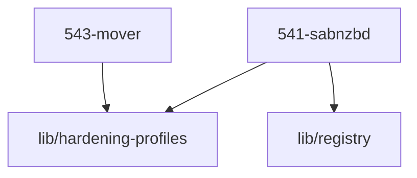

# 54-transfer: Transfer & Storage Maintenance

The **Transfer & Storage Maintenance Domain** (Domain 54) handles the heavy lifting of moving data. It is responsible for downloading media securely via Usenet and managing the flow of data across different storage tiers (from high-speed SSD staging to high-capacity HDD cold storage).

## 🎯 Core Responsibilities

1. **Usenet Downloading:** Running SABnzbd to fetch files requested by the Acquisition domain (Domain 53).
2. **Storage Tiering (The Mover):** An event-driven script that monitors the SSD staging area (Tier-B). If it gets too full, the Mover automatically transfers large media files to the spinning HDD archive (Tier-C) to free up space, preventing the SSD from filling up completely.

## 🧩 Services in the Dezimalrahmen

Each module is configured according to the mediNix Dezimalrahmen convention:

| ID  | Module / Service | Port/UID | Status | Responsibility |
| :--- | :--- | :--- | :--- | :--- |
| **541** | [sabnzbd](541-sabnzbd.nix)   [[ADR-5260]] | `5410` | active | **SABnzbd** — The primary Usenet downloader. Writes strictly to the SSD staging directory. |
| **543** | [mover](543-mover.nix)   [[ADR-5430]] | N/A | active | **Tier-B → Tier-C Mover**. An on-demand script triggered by filesystem events, moving data to spinning disks only when necessary. |

## 🔗 Dependencies & Architecture Graph

Die Module in diesem Ordner greifen auf folgende zentrale System-Bibliotheken zurück:

- `lib/hardening-profiles` (Python- und Skript-Hardening)
- `lib/registry` (SSoT für Port 5410, UID 5410, StateDir)

## 🛡️ Key Architecture Decisions

- **Event-Driven Mover (No Cron):** The Mover (`543-mover.nix`) does **not** run on a rigid schedule. It uses a `systemd.path` trigger. It only wakes up when new files are written to the SSD. If the SSD has enough free space (`minFreeGb`), it goes right back to sleep. This allows the mechanical HDDs to stay spun down to save power and reduce noise.
- **Mover Safety Safeguards:** Active-handle check via `lsof -t` avoids touching files actively written by unpackers; a 5-minute age buffer (`-mmin +5`) ensures write finality; atomic publish via `.staging_mover` and `mktemp` prevents partially transferred files from being visible; destination collision checks prevent silent overwrites; concurrency protection via `flock`; source files are deleted only upon verified transfer success. Operates directly on the physical storage backends (SSD HOT → HDD COLD) while Jellyfin reads seamlessly via MergerFS.
- **RAM-Disk for Downloads:** SABnzbd (`541-sabnzbd.nix`) uses a `tmpfs` (RAM disk) mounted at `/run/sabnzbd-tmp` for its temporary download chunks. This drastically reduces write wear on the SSD during the unpacking and repairing phase of large media files.
- **TPM-Bound Provider Credentials:** Usenet provider credentials are not stored in plaintext. They are injected directly from a TPM-encrypted `systemd-credential` file at runtime (`LoadCredentialEncrypted`).
- **Defense-in-Depth Network Confinement:** SABnzbd is dual-protected when usenet-confinement is active: nftables policy routing routes Usenet traffic over the VPN interface with a hard drop rule, while systemd's cgroup-BPF `RestrictNetworkInterfaces = [ "lo" vpnIf ]` restricts network interfaces directly in the Linux kernel.
