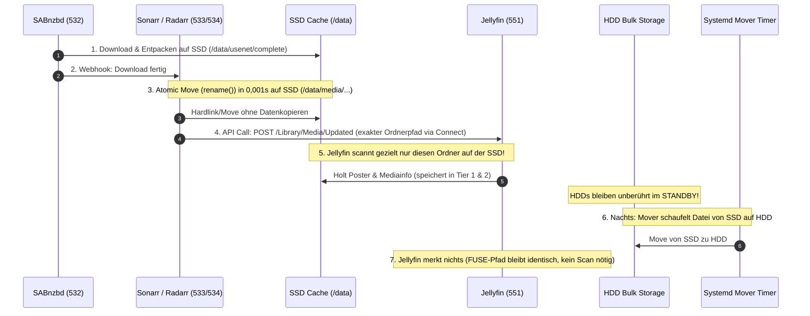
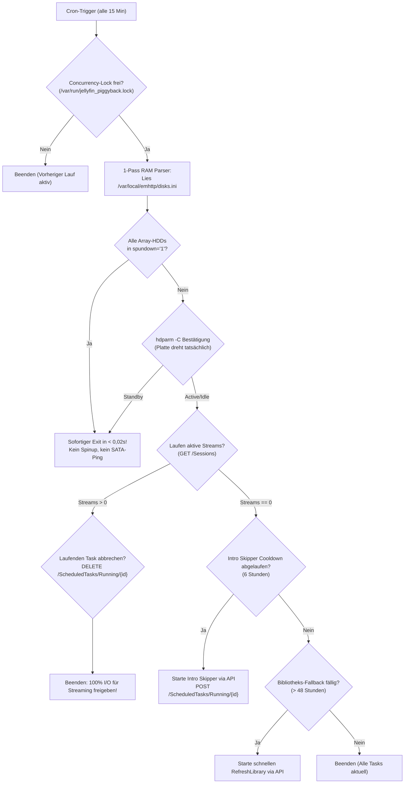

# Jellyfin 12.0 — Production Tuning, Spindown & Migration Guide (Unraid $\rightarrow$ mediNix/NixOS)

> [!NOTE] 🤖 Context & Mission Briefing for LLMs, Autonomous Agents & Git Reviewers
> **Zweck dieses Dokuments:**  
> Dieses Dokument überführt die in der Unraid/Docker-Produktionsumgebung (`Tower`) erprobten, tiefgreifenden Optimierungen für **Jellyfin 12.0** in das deklarative Paradigma von **mediNix-core (NixOS)**.
> 
> Es dient als Referenzhandbuch und Architektur-Spezifikation für die Implementierung in [`551-jellyfin.nix`](./551-jellyfin.nix). 
> Bei Modifikationen oder Refactorings in dieser Domain müssen die hier definierten **Architektur-Invarianten** (insb. FUSE-Inotify-Bypass, RAM-Transcoding, Metadaten-Cache-Trennung, opportunistisches Task-Piggybacking und Wartungsfenster-Harmonisierung) zwingend erhalten bleiben.

---

## 1. Das Kernproblem: Warum Festplatten tagsüber aufwachen (und wie mediNix es löst)

Auf klassischen Medienservern laufen mechanische Festplatten (HDDs) oft 24/7 oder wachen im Stundentakt auf. Ursachen sind:
1. **Verteilte Intervall-Scans & starre Nacht-Trigger:** Jellyfin scannt Bibliotheken standardmäßig alle 12–24 Stunden oder führt nächtliche Tasks aus, die selbst bei null Änderungen alle HDDs aufwecken.
2. **Die FUSE / Pooling Inotify-Falle:** Dateisystem-Echtzeitwächter (`inotify`) lauschen auf gepoolten User-Shares (Unraid `shfs` oder MergerFS). Sobald ein Download auf die SSD geschrieben wird, fragt der Pooling-Treiber alle Member-Festplatten ab und weckt sie grundlos auf!
3. **LUFS-Audio-Passes:** Automatische Lautstärke-Normalisierung zwingt `ffmpeg`, neu hinzugefügte Medien komplett von Anfang bis Ende durchzulesen.
4. **Schreiblast durch Transcoding:** Transcode-Segmente werden auf SSDs/Festplatten geschrieben und verbrennen I/O und TBW-Lebensdauer.

### Die Ziel-Metrik: „22+ Stunden Deep Sleep & Echte Plattenruhe“
* **Festplatten-Zustand:** Mechanische HDDs verbleiben über 22 Stunden pro Tag im `standby`.
* **Aufwach-Bedingung 1:** Ein Benutzer drückt aktiv auf „Play“ für einen bestehenden Film auf dem HDD-Array.
* **Aufwach-Bedingung 2:** Der nächtliche Mover schaufelt fertige Downloads von der SSD auf die HDDs.
* **Niemals Aufwachen:** Reine Bibliotheks-Checks, Metadaten-Scans oder Intro-Analysen dürfen niemals eigenständig schlafende Festplatten starten!

---

## 2. Die 3-Tier Speicher-Architektur (Storage Tiering)

Die Ablage ist streng nach Zugriffsfrequenz und Latenz getrennt:

```
┌─────────────────────────────────────────────────────────────────────────────┐
│ Tier 0: RAM-Disk (tmpfs)                                                    │
│ Path: /transcode (size=4G)                                                  │
│ Data: Transcoder-Segmente, HLS-Chunks                                       │
│ I/O: 0 SSD-Writes! 100% flüchtig, maximale Geschwindigkeit.                 │
└──────────────────────────────────────┬──────────────────────────────────────┘
                                       │
┌──────────────────────────────────────┴──────────────────────────────────────┐
│ Tier 1: NVMe System-SSD (State / DB / Secrets)                              │
│ Path: /var/lib/jellyfin-5510/ (mediNix stateDir) & /secrets/                │
│ Data: SQLite-Datenbanken (jellyfin.db, introskipper.db), Logs, Configs,     │
│       POSIX-geschützte API-Tokens (chmod 600).                              │
│ Access: Exklusiver Read/Write, extrem schnelle Lese-/Schreibzugriffe.       │
└──────────────────────────────────────┬──────────────────────────────────────┘
                                       │
┌──────────────────────────────────────┴──────────────────────────────────────┐
│ Tier 2: SSD Cache Pool (Metadaten & Download-Landingzone)                   │
│ Path: /var/cache/medinix/metadata/jellyfin/ & /data/usenet/                 │
│ Data: Cover, Poster, Backdrops, Trickplay-Bilder, Intro-Fingerprints        │
│ Advantage: UI-Browsing & Metadaten-Generierung belasten NIEMALS die HDDs.   │
└──────────────────────────────────────┬──────────────────────────────────────┘
                                       │
┌──────────────────────────────────────┴──────────────────────────────────────┐
│ Tier 3: Bulk HDD Storage (Array / MergerFS / ZFS)                           │
│ Path: /data/media/ (movies, tv, music) — Read-Only (:ro) gemappt!          │
│ Data: Große MKV/MP4-Videodateien.                                           │
│ Security: BindReadOnlyPaths verhindert Datenzerstörung durch App/Bugs.     │
└─────────────────────────────────────────────────────────────────────────────┘
```

> [!NOTE] Dashboard-Anzeige-Mythos (`/cache: 203.7 GiB / 238.4 GiB`)
> Im Jellyfin-Dashboard unter *Server $\rightarrow$ Dashboard* wird für `/cache` oft die Partitionsgröße des gesamten Cache-Pools (`statvfs`) angezeigt, **nicht** die Größe des Jellyfin-Cache-Ordners selbst! Der tatsächliche Ordner ist meist nur wenige Megabyte groß.

---

## 3. Der lückenlose Ingestion- & Atomic-Move-Kreislauf

Damit ein neuer Download vollautomatisch verarbeitet wird, **ohne** dass eine HDD anläuft:



### Event-Driven Library Updates (*arr Connect mit Pfad-Remapping)
Sonarr und Radarr sind über native `MediaBrowser`-Verbindungen (Connect) mit Jellyfin gekoppelt (`updateLibrary: true`).
Damit Jellyfin den gemeldeten Pfad korrekt auflöst, ist ein präzises Pfad-Mapping zwingend hinterlegt:
* **Radarr:** `mapFrom: /data/media/movies` $\rightarrow$ `mapTo: /data/movies`
* **Sonarr:** `mapFrom: /data/media/tv` $\rightarrow$ `mapTo: /data/tv`

Sobald Sonarr/Radarr einen Import abschließen, senden sie einen zielgerichteten API-Call (`POST /Library/Media/Updated`) für genau diesen neuen Verzeichnispfad. Das eliminiert jeden Bedarf für regelmäßige Komplettscans.

> [!WARNING] Dateisystem-Schutzregel für den Mover (`minfreespace` / `shareFloor`)
> Der nächtliche Mover-Dienst muss zwingend eine freie Mindestreserve von mindestens **7%** (z. B. `minfreespace = 30G` oder `shareFloor = 25G`) auf allen Ziellaufwerken wahren. 
> Läuft ein Dateisystem (insb. XFS / Btrfs / ZFS) voll, bricht die Schreibperformance durch B-Tree-Fragmentierung massiv ein. Bei Kapazitätsengpässen verbleiben neue Mediendateien lieber auf dem SSD-Cache, während automatisierte Tools wie **Maintainerr** alte/gesehene Medien abräumen.
> 
> **Mover-Sicherheitsgarantie:** Unraid evaluiert den Speicherplatz vor dem Verschieben. Reicht der Platz nicht, bricht der Mover sauber ab, löscht die Zieldatei auf der HDD und belässt die Quelldatei auf der SSD zu 100% intakt.

---

## 4. Die zwei kritischen Jellyfin-Bibliotheks-Flags (Invarianten!)

In jeder Jellyfin-Bibliothek (`Filme`, `Serien` etc.) müssen über die REST-API (`POST /Library/VirtualFolders/LibraryOptions`) folgende zwei Flags gesetzt werden:

### A. `EnableRealtimeMonitor: false` (Inotify-Bypass)
* **Warum?** Linux-`inotify` überwacht Dateiänderungen. Auf Union-Dateisystemen (Unraid `shfs`, MergerFS) erzeugt jede Verzeichnisänderung einen rekursiven Lookup auf **allen** physischen Mitgliedsplatten. Das weckt alle schlafenden Festplatten auf, selbst wenn die geschriebene Datei auf der SSD liegt!
* **Ersatz:** Neue Medien werden ausschließlich gezielt über die Sonarr/Radarr-API (`POST /Library/Media/Updated`) gemeldet.

### B. `EnableLUFSScan: false` (Audio-Pass-Eliminierung)
* **Warum?** Verhindert, dass `ffmpeg` bei neuen Episoden und Filmen die komplette Tonspur durchdekodiert.
* **Ergebnis:** Massiv reduzierte CPU-Last, Schonung der SSDs und Vermeidung von I/O-Spitzen.

---

## 5. Das Spindown-Paradigma: Von starren Triggern zu opportunistischem Piggybacking

In frühen Versionen dieses Setups wurden die Tasks auf ein starres nächtliches Wartungsfenster (04:00–05:00 Uhr) gelegt. In der Praxis zeigte sich jedoch: **Selbst ein gebündeltes 04:00-Uhr-Fenster weckt das mechanische Array jede Nacht grundlos auf**, selbst wenn in den letzten 48 Stunden kein einziger neuer Film hinzugefügt wurde.

Die Architektur wurde daher auf **vollständige Plattenruhe mit opportunistischem Piggybacking** weiterentwickelt.

### 5.1 Deaktivierung aller starren Trigger in Jellyfin
Über die REST-API (`POST /ScheduledTasks/{taskId}/Triggers` mit leerem JSON-Array `[]`) wurden alle 7 HDD-intensiven Hintergrundaufgaben von ihren automatischen Auslösern befreit:

| Task-ID | Name in Jellyfin | Vorheriger Trigger | Neuer Status | Grund |
| :--- | :--- | :--- | :--- | :--- |
| `7738148ffcd07979c7ceb148e06b3aed` | **Medien-Bibliothek scannen** | Täglich 04:00 Uhr | Manuell / API-only | Importe/Löschungen kommen per Event-Push aus Sonarr/Radarr Connect |
| `f861734dd71b37f9482b52a820e39013` | **Mediensegmente scannen (Intro Skipper)** | Täglich 04:20 Uhr | Manuell / API-only | Analysiert opportunistisch bei drehender Platte oder auf SSD |
| `64f5f44cd30dc273cb9890205473bbcc` | **Trickplay-Bilder generieren** | Täglich 04:00 Uhr | Manuell / API-only | In Bibliotheken deaktiviert; CPU- und I/O-Schonung |
| `4e6637c832ed644d1af3370a2506e80a` | **Kapitelvorschauen erstellen** | Täglich 04:05 Uhr | Manuell / API-only | In Bibliotheken deaktiviert |
| `ec2f221fd8e7706b3d3afd2c4591b4d7` | **Audio Normalisierung** | Täglich 04:35 Uhr | Manuell / API-only | Weckte unnötig das Array auf |
| `2c66a88bca43e565d7f8099f825478f1` | **Fehlende Untertitel herunterladen** | Täglich 04:45 Uhr | Manuell / API-only | Keine externen Subtitle-Fetcher konfiguriert |
| `26649fe0aad57557245351f220da916c` | **Fehlende Songtexte herunterladen** | Täglich 04:55 Uhr | Manuell / API-only | Keine Musik-Bibliothek vorhanden |

Reine NVMe-Systemaufgaben (Datenbank-Bereinigung, Log-Rotation) bleiben davon unberührt, da sie 100% auf SSD laufen.

---

### 5.2 Der opportunistische Task-Runner (`jellyfin_piggyback` v3)

Anstelle von starren Zeiten prüft ein intelligenter Task-Runner alle 15 Minuten per Cron/Timer den Status des Servers:



#### Die 7 Kern-Sicherheitsmechanismen des Piggyback-Runners:
1. **Zero-Overhead bei Plattenruhe (< 0,02 Sekunden):** Liest ausschließlich den RAM-Cache (`/var/local/emhttp/disks.ini` bzw. in NixOS den Kernel-Powerstate unter `/sys/block/sd*/device/state`). Schlafen die Platten, beendet sich das Skript ohne jegliche Festplatten- oder Controller-Interaktion.
2. **Echtes POSIX-Secret auf NVMe:** Der API-Token liegt auf einem Dateisystem mit echten Linux-Rechten (`/mnt/docker_and_vm/secrets/jellyfin_piggyback.token`, `chmod 600`, owner `root:root`).
3. **Flock-Concurrency-Schutz:** Verhindert Überlappungen durch `/var/run/jellyfin_piggyback.lock`.
4. **Wiedergabeschutz mit Prioritätsabbruch:** Beginnt ein Nutzer während eines Hintergrundlaufs einen Film, bricht der Runner den Job sofort via `DELETE /ScheduledTasks/Running/{id}` ab. In Jellyfin verifiziert: Der Task bricht sauber mit `State: Idle` ab, ohne die Datenbank zu beschädigen.
5. **Cooldown-Sperre:** Intro-Skipper wird maximal alle 6 Stunden angestoßen (Prüfung gegen `LastExecutionResult.EndTimeUtc`).
6. **48-Stunden-Fallback:** Voller Medienscan nur alle 48 Stunden als Rückfallebene für manuelle Dateiänderungen außerhalb von Sonarr/Radarr.
7. **Direkte Bridge-Kommunikation:** Kommunikation erfolgt direkt containerintern (`docker exec jellyfin curl http://localhost:8096`) oder per Loopback `127.0.0.1`, unabhängig von Reverse-Proxy-Zuständen.

---

## 6. Hardware-Transcoding: Intel Quick Sync (HD 630 / Kaby Lake)

Die Intel Core i5-7400T / HD Graphics 630 (`[8086:5912]`) läuft am physikalischen Maximum:
* **Benchmark:** `10.7x` Echtzeit bei `268 fps` (1080p HEVC Main 10 $\rightarrow$ H.264).
* **Treiber in NixOS (`hardware.graphics`):**
  * `intel-media-driver` (iHD — primärer VA-API Treiber)
  * `vpl-gpu-rt` (oneVPL Runtime)
  * `intel-compute-runtime` (OpenCL für Tone Mapping)
* **Tone Mapping:** VPP Tone Mapping aktiviert (`EnableVppTonemapping = true`), konvertiert HDR10 zu SDR hardwarebeschleunigt ohne CPU-Spitzen.
* **Architektur-Grenzen der HD 630 (zwingend beachten!):**
  * `AllowAv1Encoding = false` (Kaby Lake kann kein AV1 encodieren; Software-AV1 würde 100% aller 4 CPU-Kerne lahmlegen).
  * `EnableIntelLowPowerH264HwEncoder = false` (HuC Low-Power-Encoder existiert bei Kaby Lake nicht).
  * `EnablePlaybackRemuxing = false` (erzwingt sauberes Transcoding bei Dolby Vision Profile 8, verhindert Wiedergabeabbrüche auf Apple/FireTV-Clients).

### Die Sidecar-Konfigurations-Regel (`encoding.sidecar.xml`)
Jellyfins interner `.NET XmlSerializer` verwirft beim Speichern in der WebUI alle XML-Kommentare. 
In mediNix wird daher eine unveränderliche Master-Referenz gepflegt (`encoding.sidecar.xml`), die als Template für deklarative Generierungen dient und Benchmarks sowie Hardware-Limits dauerhaft dokumentiert.

---

## 7. Account-Sicherheit, Privilege Separation & CrowdSec Brute-Force-Schutz

Da Jellyfin (ohne instabile Drittanbieter-Plugins) kein Single-Sign-On (SSO / Pocket-ID) unterstützt, greift ein fein austariertes mehrstufiges Schutzkonzept:

1. **Vollständige Anmeldebildschirm-Anonymisierung (`IsHidden: true`):**
   * Alle Benutzerkonten (insb. Admins) werden auf `IsHidden = true` gesetzt. Externe Angreifer sehen keine Benutzernamen auf der Anmeldeseite.
2. **Account-Lockout Policy (5 Versuche):**
   * `LoginAttemptsBeforeLockout = 5`: Sperrt Konten nach 5 Fehlversuchen temporär.
   * **Familien-Sicherheit:** Nach 5 falschen Eingaben (z. B. durch Familienmitglieder) wird nur das jeweilige Benutzerkonto pausiert — die IP-Adresse und der Internetanschluss des Haushalts bleiben 100% sauber und unblockiert!
3. **Privilege Separation (Trennen von Admin & Streaming):**
   * **Dedizierter System-Admin:** `moritzbaumeister@gmail.com` (`IsAdministrator: true`, `EnableRemoteAccess: true`, `IsHidden: true`, `LoginAttemptsBeforeLockout: 5`).
   * **Alltags-Streaming-Konto:** `moritzbaumeister` wurde vollständig auf ein Standard-Streaming-Konto herabgestuft (`IsAdministrator: false`, `EnableContentDeletion: false`, `EnableContentDownloading: true`), um die Angriffsfläche bei normaler Nutzung auf 0 zu minimieren.
4. **Caddy + CrowdSec Bouncer mit 10er-Schwelle („Mama-Puffer“):**
   * CrowdSec überwacht `/var/log/jellyfin/log_*.log` über die Collection `LePresidente/jellyfin`.
   * **Szenario-Tuning:** Das Szenario `jellyfin-bf.yaml` wird auf `capacity: 10` gesetzt (statt Default 5).
   * **Der Effekt:** Es entsteht ein Sicherheitspuffer von 5 weiteren Fehlversuchen nach der Kontosperre. Scheitert ein menschlicher Nutzer 5-mal, greift nur die Kontosperre. Erst wenn ein automatisierter Bot trotz gesperrtem Konto stur weiter hämmert und Versuch 10 erreicht, sperrt CrowdSec die Angreifer-IP an der Haustür in Caddy (`HTTP 403 Forbidden`).
5. **Lokales Subnetz & LAN-Whitelist:**
   * Private RFC1918-Netze (`192.168.0.0/16`, `10.0.0.0/8`, `172.16.0.0/12`) sind in CrowdSec dauerhaft auf der Whitelist.
   * `LocalNetworkSubnets = "192.168.2.0/24"` in Jellyfin verhindert Bandbreitendrosselung lokaler Clients hinter Caddy.

---

## 8. mediNix / NixOS Implementierungs-Blueprint (`551-jellyfin.nix`)

Folgende Bausteine müssen in `mediNix-core` integriert bzw. verifiziert werden:

### A. Systemd Service Sandbox & tmpfs Mount
```nix
systemd.services.jellyfin = {
  serviceConfig = {
    # Tier 0: Transcode direkt im RAM (0 SSD-Writes)
    TemporaryFileSystem = "/transcode:size=4G";
    
    # Tier 3: Medien streng Read-Only schützen
    BindReadOnlyPaths = [ "${svc.storage.mediaRoot}:${svc.storage.mediaRoot}" ];
    
    # Tier 1 & 2: Beschreibbare Pfade isolieren
    ReadWritePaths = [ stateDir metadataDir ];
    
    # Hardware-Transcoder Zugriff
    DeviceAllow = [ "/dev/dri/renderD128 rwm" ];
    SupplementaryGroups = [ "video" "render" ];
  };
};
```

### B. Declarative Secret Management (sops-nix / age)
```nix
sops.secrets."jellyfin/piggyback-token" = {
  owner = "root";
  group = "root";
  mode = "0600";
};
```

### C. Post-Boot Library Configuration (Inotify & LUFS Abschaltung)
```bash
#!/usr/bin/env bash
# medinix-jellyfin-tune.sh — Setzt Library Options via REST-API
set -euo pipefail

TOKEN=$(cat /run/credentials/jellyfin.service/api-token)
API="http://127.0.0.1:5510"

# 1. Alle Mediatheken auf Inotify=false & LUFS=false setzen
FOLDERS=$(curl -sf -H "Authorization: MediaBrowser Token=\"$TOKEN\"" "$API/Library/VirtualFolders")
echo "$FOLDERS" | jq -c '.[]' | while read -r folder; do
  ID=$(echo "$folder" | jq -r '.ItemId')
  NAME=$(echo "$folder" | jq -r '.Name')
  OPTS=$(echo "$folder" | jq '.LibraryOptions | .EnableRealtimeMonitor=false | .EnableLUFSScan=false')
  
  curl -sf -X POST -H "Authorization: MediaBrowser Token=\"$TOKEN\"" \
       -H "Content-Type: application/json" \
       -d "{\"Id\": \"$ID\", \"LibraryOptions\": $OPTS}" \
       "$API/Library/VirtualFolders/LibraryOptions"
  echo "[-] Library '$NAME' (ID $ID): Inotify & LUFS disabled."
done

# 2. Alle starren Scheduled Tasks Trigger deaktivieren (Triggers = [])
for TASK in "7738148ffcd07979c7ceb148e06b3aed" "f861734dd71b37f9482b52a820e39013" \
            "64f5f44cd30dc273cb9890205473bbcc" "4e6637c832ed644d1af3370a2506e80a" \
            "ec2f221fd8e7706b3d3afd2c4591b4d7" "2c66a88bca43e565d7f8099f825478f1" \
            "26649fe0aad57557245351f220da916c"; do
  curl -sf -X POST -H "Authorization: MediaBrowser Token=\"$TOKEN\"" \
       -H "Content-Type: application/json" \
       -d "[]" \
       "$API/ScheduledTasks/$TASK/Triggers"
done
```

### D. mediNix Opportunistischer Piggyback Service (`systemd.timers`)
In mediNix wird ein systemd-Timer alle 15 Minuten aktiv:
* Prüft `/sys/block/sd*/device/state` auf `active` oder `standby`.
* Läuft das Array nicht $\rightarrow$ Beendet sich sofort.
* Dreht das Array $\rightarrow$ Fragt `$API/Sessions` ab. Sind 0 Sessions aktiv, wird der Intro Skipper gestartet.
* Startet währenddessen ein Stream $\rightarrow$ Sendet `DELETE $API/ScheduledTasks/Running/{id}`.

---

## 9. Checkliste für die NixOS-Migration

- [ ] **Grafiktreiber:** `hardware.graphics` mit `intel-media-driver` und `vpl-gpu-rt` aktiviert.
- [ ] **Render-Device:** `/dev/dri/renderD128` für `jellyfin`-Nutzer freigegeben.
- [ ] **Transcode:** `TemporaryFileSystem = "/transcode:size=4G"` in systemd gesetzt.
- [ ] **Encoding Config:** `encoding.xml` mit QSV, VPP Tone Mapping und deaktiviertem AV1 initialisiert.
- [ ] **Sonarr / Radarr Connect:** `MediaBrowser`-Webhook mit Pfad-Mapping auf `http://127.0.0.1:5510` eingerichtet.
- [ ] **Inotify & LUFS:** Beide Optionen über die API für alle Mediatheken auf `false` gesetzt.
- [ ] **Scheduled Tasks:** Alle 7 starren Trigger per REST-API auf `[]` geleert.
- [ ] **Opportunistischer Runner:** Piggyback-Timer mit Playback-Abbruchschutz und 6h-Cooldown aktiv.
- [ ] **Security:** Konten auf `IsHidden = true` gesetzt, Privilege Separation eingerichtet (Admin getrennt von Alltags-Streaming-User).
- [ ] **CrowdSec:** Bouncer mit Jellyfin-Logfile gekoppelt, Szenario `jellyfin-bf.yaml` mit `capacity: 10` gepuffert.
