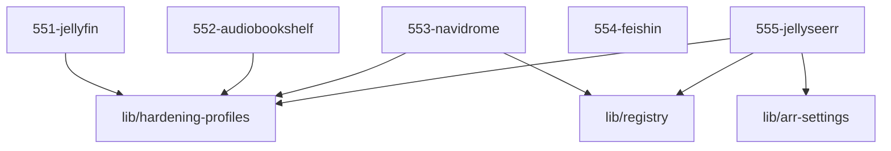

# LLM Wiki: `55-playback`

> **Zweck:** [BITTE MANUELL AUSFUELLEN: Wofuer ist dieser Ordner zustaendig?]

<!-- AUTO-GENERATED, DO NOT EDIT BELOW -->

## Module Map

| ID | Modul-Datei | Status | Komplexitaet | Ports |
|---|---|---|---|---|
| `551-jellyfin` | `551-jellyfin.nix` | active | 4/5 | - |
| `552-audiobookshelf` | `552-audiobookshelf.nix` | active | 4/5 | - |
| `553-navidrome` | `553-navidrome.nix` | active | 3/5 | - |
| `554-feishin` | `554-feishin.nix` | active | 2/5 | - |
| `555-jellyseerr` | `555-jellyseerr.nix` | active | 3/5 | - |

## Interne Abhaengigkeiten (Requires)

Die Module in diesem Ordner benoetigen folgende Bibliotheken/Dateien:

- `lib/arr-settings`
- `lib/hardening-profiles`
- `lib/registry`

## Dependency Graph

---
*Generiert durch `medinix-meta.py generate-docs`*
