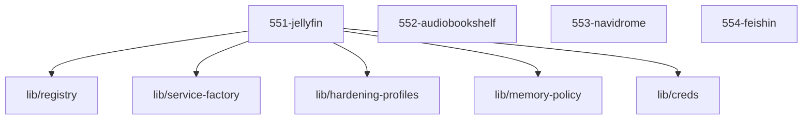

# LLM Wiki: `55-playback`

> **Zweck:** Wiedergabe — Medienserver und ihre Weboberflächen.

Alles **unterhalb der AUTO-GENERATED-Markierung** stammt aus den NIXMETA-Headern
(`python3 50-core/medinix-meta.py generate-docs`) — **nie** von Hand ändern, sonst
wird `check-docs` rot. Dieser manuelle Teil bleibt erhalten (den Marker-String
nicht wörtlich im Text nennen, sonst schneidet der Generator dort ab).

**Rolle:** Playback-/Media-Domäne (55x).

**Verantwortung:**
- `551` Jellyfin, `552` Audiobookshelf, `553` Navidrome — Registry-Rolle `stream`
- `554` Feishin — statische SPA (Rolle `none`) als Oberfläche für Navidrome
- Landing-Kacheln: die Module setzen `landing` + `iconSvg`/`iconId` selbst

**Nicht verantwortlich für:**
- Zugangskontrolle → `51-ingress`: `stream` heißt WAN-sichtbar **ohne** `forward_auth`, die App authentifiziert selbst (OIDC gegen Pocket ID, ADR-517)
- Transcoding-/GPU-Hardware → 50-core
- Speicherpfade/Tiering → `57-maintenance`

**Source of truth:**
- Port/UID/Rolle → `lib/registry.nix` (`jellyfin`/`audiobookshelf`/`navidrome` = `stream`)
- Kachel-Darstellung → `51-ingress/518-landingpage.nix` plus `ingress.vhosts.<name>.landing`/`iconId`/`iconSvg`

**Bekannte Klemmen:**
- `stream` ist WAN-offen ohne Ingress-Auth. 511 lässt es nur zu, wenn der Manifest-Eintrag `stream` deklariert **oder** der Dienst in `medinix.ingress.streamAck` steht (Review 2026-10-17, Finding 20) — ein Vhost-Override auf `stream` ist kein Freibrief.
- `idp` ist per Assertion dem IdP selbst vorbehalten.

<!-- AUTO-GENERATED, DO NOT EDIT BELOW -->

> ⚙️ **Maschinell erzeugt** aus den NIXMETA-Headern der Module (`python3 50-core/medinix-meta.py generate-docs`).
> **Nicht von Hand aendern** — handgepflegt ist nur der Teil **ueber** der Markierung; die Wahrheit steht in den unten verlinkten `.nix`-Dateien (`docs/CONVENTIONS.md` §1).

## Module Map

| ID | Modul-Datei | Status | Komplexitaet | Ports |
|---|---|---|---|---|
| `551-jellyfin` | [`551-jellyfin.nix`](551-jellyfin.nix) | active | 3/5 |  |
| `552-audiobookshelf` | [`552-audiobookshelf.nix`](552-audiobookshelf.nix) | active | -/5 | - |
| `553-navidrome` | [`553-navidrome.nix`](553-navidrome.nix) | active | -/5 | - |
| `554-feishin` | [`554-feishin.nix`](554-feishin.nix) | active | -/5 | - |

## Interne Abhaengigkeiten (Requires)

Die Module in diesem Ordner benoetigen folgende Bibliotheken/Dateien:

- [`lib/creds`](../lib/creds.nix)
- [`lib/hardening-profiles`](../lib/hardening-profiles.nix)
- [`lib/memory-policy`](../lib/memory-policy.nix)
- [`lib/registry`](../lib/registry.nix)
- [`lib/service-factory`](../lib/service-factory.nix)

## Dependency Graph

```mermaid
graph TD
  551_jellyfin["551-jellyfin"] --> registry["lib/registry"]
  551_jellyfin["551-jellyfin"] --> service_factory["lib/service-factory"]
  551_jellyfin["551-jellyfin"] --> hardening_profiles["lib/hardening-profiles"]
  551_jellyfin["551-jellyfin"] --> memory_policy["lib/memory-policy"]
  551_jellyfin["551-jellyfin"] --> creds["lib/creds"]
  552_audiobookshelf["552-audiobookshelf"]
  553_navidrome["553-navidrome"]
  554_feishin["554-feishin"]
```

---
*Maschinell erzeugt durch `python3 50-core/medinix-meta.py generate-docs` aus den NIXMETA-Headern der oben verlinkten `.nix`-Dateien. Handgepflegt ist nur der Teil ueber der AUTO-GENERATED-Markierung.*
